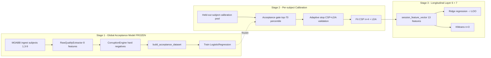
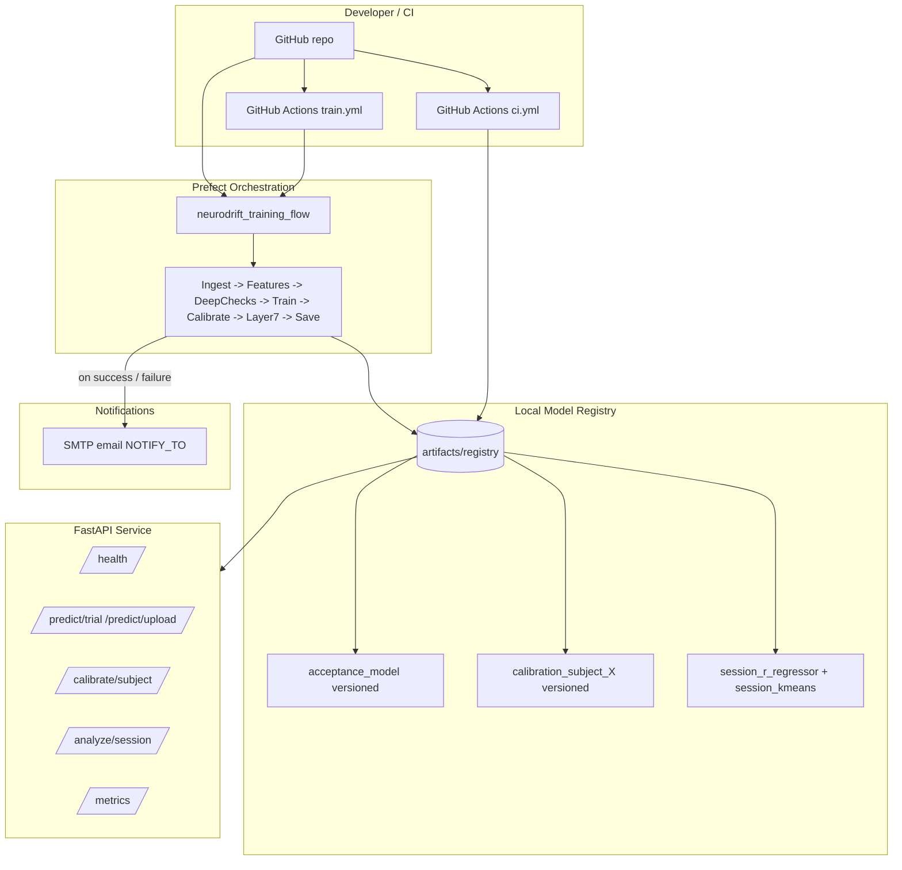
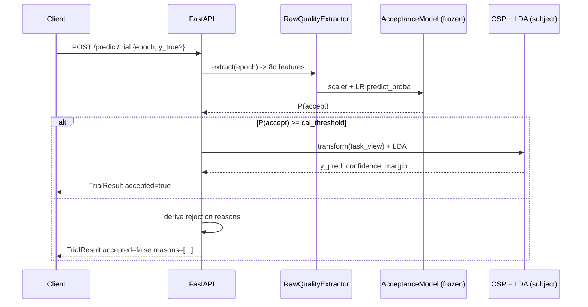
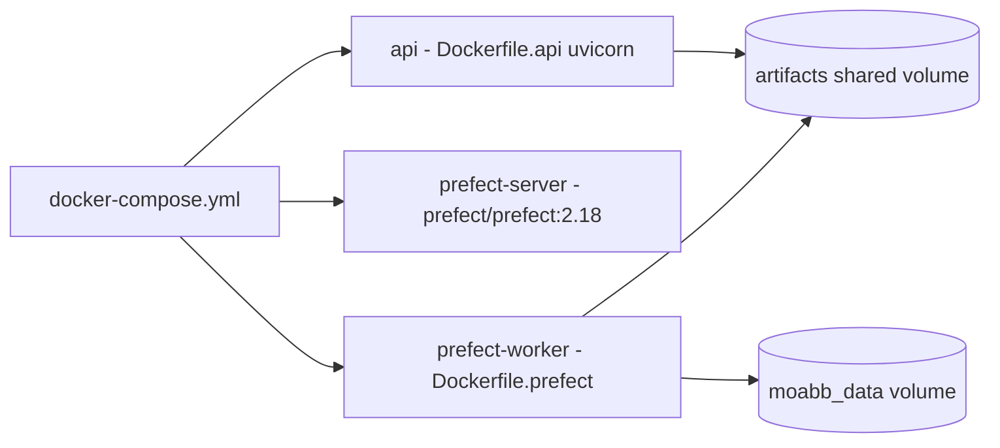
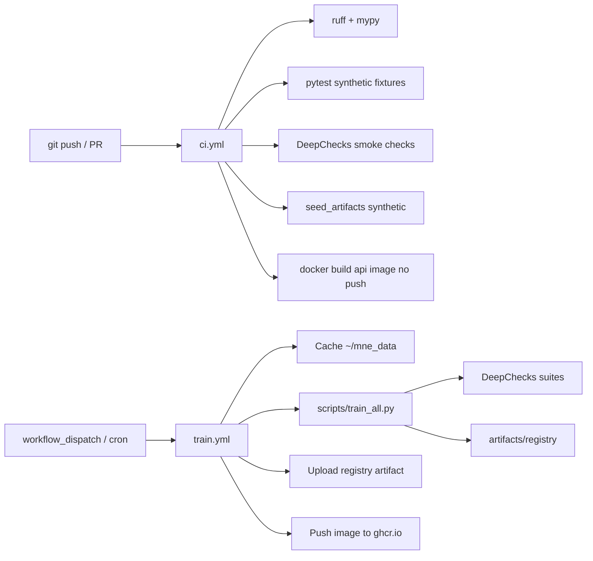
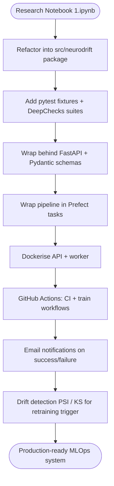

# NeuroDrift — System Architecture

## 1. Domain & Problem Statement

**Domain:** Healthcare — specifically, motor-imagery Brain–Computer Interface (BCI)
recovery monitoring. Patients with motor impairment train an EEG-decoded
classifier of left-hand vs right-hand imagery. Day-to-day, the signal quality
of an EEG session varies (electrode contact, fatigue, neurological state). A
quality-aware system that gates low-quality trials at inference time and
tracks quality drift across sessions is therefore clinically useful.

**ML Tasks Covered (rubric requirement):**

| Task                       | Module                                    |
|----------------------------|-------------------------------------------|
| Binary classification      | `models/acceptance.py` (LogReg)            |
| Per-subject classification | `models/classifier.py` (CSP + LDA)         |
| Regression                 | `models/regressor.py` (Ridge for `r`)      |
| Dimensionality reduction   | PCA in `models/regressor.py`, CSP overall  |
| Clustering                 | `models/clustering.py` (KMeans)            |
| Time-series / spectral     | Welch PSD + ERD inside `feature_extractor` |

## 2. Three-Stage Pipeline (mirrors the research notebook)

## 3. End-to-End MLOps Topology

## 4. Data Flow per Inference Request

## 5. Containerization Layout

- API: multi-stage `python:3.11-slim`, non-root user `neurodrift`,
  `HEALTHCHECK` curls `/health`.
- Prefect Server: official image, exposes UI on `:4200`.
- Prefect Worker: same Python base + project source; runs the flow on demand.
- Volumes: `artifacts` (registry shared between API and worker so the API
  always sees the latest models written by training).

## 6. CI/CD Pipeline Explanation

- **CI (`ci.yml`)** runs on every push/PR. Uses synthetic EEG only — no MOABB
  download — so the workflow finishes in under five minutes.
- **Training (`train.yml`)** runs on `workflow_dispatch` or weekly cron. Caches
  `~/mne_data` between runs, executes the full Prefect flow against real
  BNCI2014_001 data, runs DeepChecks gates, and on success uploads model
  artifacts and pushes a versioned image to GHCR.

## 7. Prefect Orchestration Detail

Each task carries `retries=3, retry_delay_seconds=30` to absorb transient
MOABB / network failures. Tasks delegate to pure functions in
`src/neurodrift/{data,models,testing,registry}` so the same code runs from
the FastAPI app, from `pytest`, and from CI.

The flow's `try/except` envelope sends an email summary on every terminal
state via `flows/notify.py` (uses `smtplib.SMTP` with `STARTTLS`). The
notifier is non-fatal: a missing SMTP secret logs a warning rather than
failing the run.

## 8. Methodology Flow Diagram

## 9. Out of Scope Items

- Online retraining from production prediction outcomes — the acceptance
  model is **frozen** by design, exactly as the notebook specifies.
- GPU / deep-learning models — the notebook stack stays classical.
- Production secret manager — environment variables only, with a clear
  `.env.example`.
